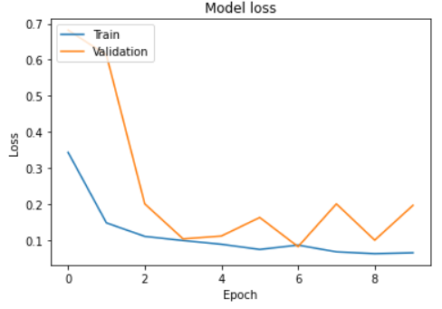
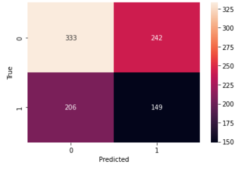
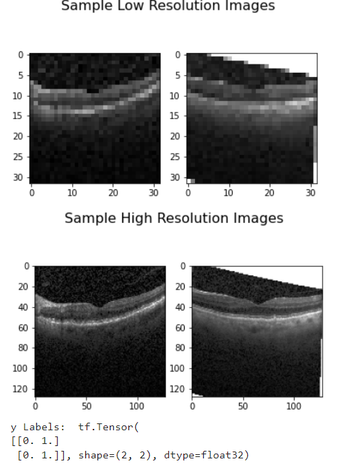
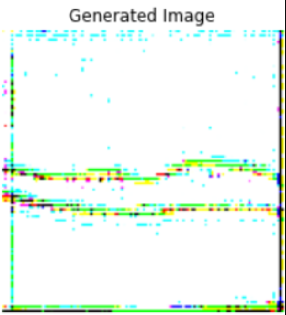
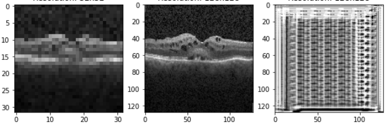
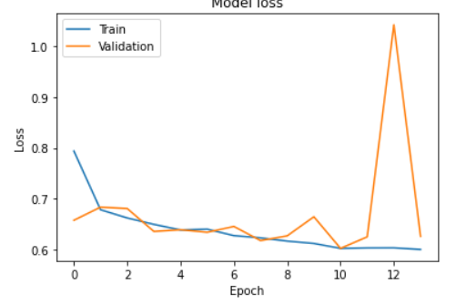
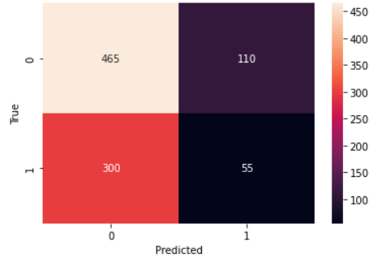

# SRGAN OCT Image Resolution Enhancement
This assignment involves building an SR-GAN network to enhance the resolution of OCT scans from 32x32 pixels to 128x128. The model underwent 200 epochs of training, with checkpoints saved every 10 epochs. In addition, two classification models were trained for evaluation purposes. One model used the original dataset with OCT scans resized to 128x128, while the other used a 128x128 OCT image dataset generated by the trained SRGAN model. The results are discussed below along with a description of the files in the repository and instructions on how to rerun the code.

## Results
### Model A
A binary classifier was first trained on the original dataset with the images resized to 128x128. The classifier was able to achieve a final training loss of 0.0654, a final training accuracy of 0.9781, a final validation loss of 0.1970, and a final validation accuracy of 0.9303. below is a plot showing the change in losses over the epochs run as well as a confusion matrix (can also be found in modelA notebook)

### Data Genrator
In order to train the SRGAN, a custom data generator was created to read in the images from the original dataset and pass three components per 'get_item'. The data geenrator would pass a bacth of 32x32 images which will be the input to the SRGAN, a batch of the same images resized to 128x128 which is the ground truth for the SRGAN, and the asscoited labels for the images in the batch. Below is an example of sample images passed on using this custom data generator (can also be found in the SRGAN notebook).

### Running Training and Inference
AFter training the SRGAN, an inference of the saved generator model was executed on some sample images. below are some of the results. It is worth noting that I believe the results are in bad conditiion to to a lack of enough training (can also be found in SRGAN and create_SR_dataset notebooks).

### Model B
The inference was then run on all images in the original dataset to create a new SR dataset of generated images. A binary classifier was then trained on said dataset. The classifier was able to achieve a final training loss of 0.6000, a final training accuracy of 0.6835, a final validation loss of 0.6258, and a final validation accuracy of 0.6672. below is a plot showing the change in losses over the epochs run as well as a confusion matrix (can also be found in modelB notebook). As can be clearly seen Model A performed much better by achieving a higher accuracy and a lower loss which is expected cosndiering the SRGAN model was not trained Adequately and thus produced irrepresntable images carrying to information regarding the scans. 

## File Descriptions
  - ModelA: Trains a classifier on the original dataset with images resized to 128x128.
  - ModelB: Trains a classifier on a dataset of generated 128x128 images.
  - SRGAN: Trains an SRGAN Network that can generate a 128x128 size image from a 32x32 image input.
  - create_SR_dataset: Runs inference of the generator on the original dataset to create a new SR dataset.
  
## To reproduce results
The project was made in a way that can allow for each notebook to be run independently of the others.
  - dowload all .ipynb files
  - Adjust direcotry in ModelA notebook to point to the original dataset. Run and see results.
  - Adjust directory in the datagenerator of SRGAN to also point to the original dataset. Run and see results.
  - Adjust path to model in create_SR-dataset to the latest model saved from training the SRGAN. Run and download new dataset.
  - Adjust direcotry in ModelB notebook to point to the generated dataset. Run and see results.
